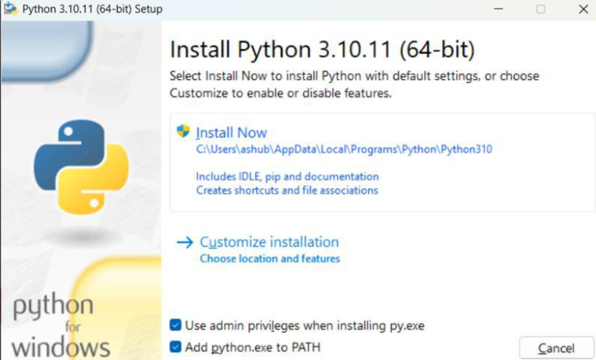
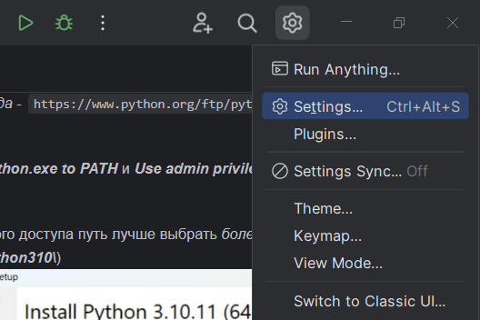
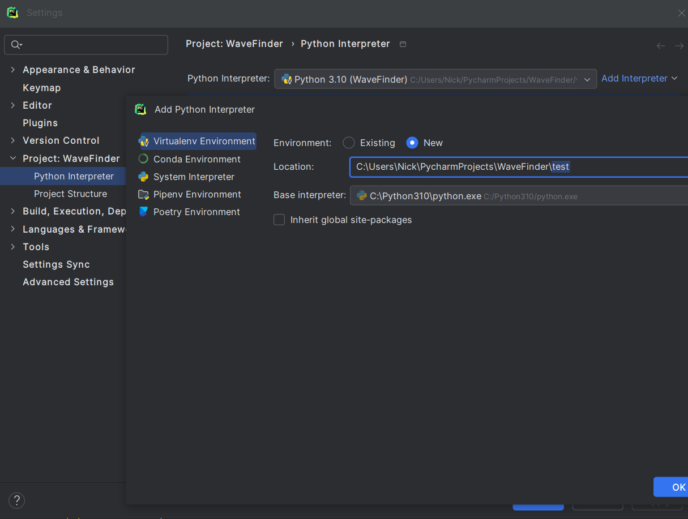
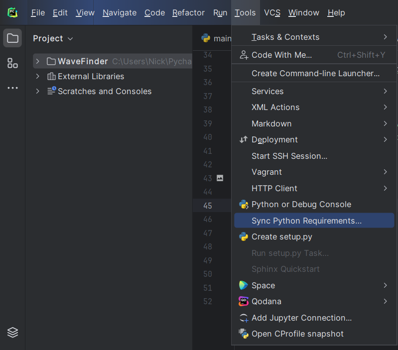
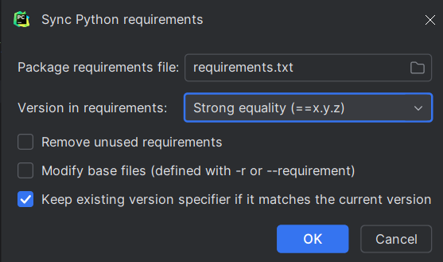

# WaveFinder

___

## Требования

- **python** == **3.10.6** - **ОБЯЗАТЕЛЬНО! (не выше и не ниже)**
- **tensorflow** == **2.10.1** - **ОБЯЗАТЕЛЬНО! (не выше и не ниже)**

___

## Установка

___

### 1.1 Python

_Скачивать отсюда_ - ```https://www.python.org/ftp/python/3.10.6/python-3.10.6-amd64.exe```

Отметить _**Add python.exe to PATH**_ и _**Use admin privileges when installing py.exe**_

Для более удобного доступа путь лучше выбрать _более простой_ (например, _**C:\Python310\\**_)


___

### 1.2 Открытие проекта в PyCharm

Можно работать с проектом в любом редакторе, но _**PyCharm**_ наиболее предпочтительный

При открытии выбрать настройки в правом верхнем углу:



Далее необходимо добавить интерпретатор
```
Add Interpretator -> 
Virtualenv Environment -> 
Location - выбрать расположение venv(папка, где будет складываться) -> 
Base interpreter - выбрать установленный интерпретатор)
```



Далее нужно перейти в _**Sync Python Requirements...**_



После чего выбрать файл [зависимостей](resources/requirements.txt) и отметить _**Strong equality**_ в настройках:



Запуск проекта происходит из файла [main.py](main.py)

___

## Запуск

Файл с описанием работы [readme.docx](docs/readme.docx)


